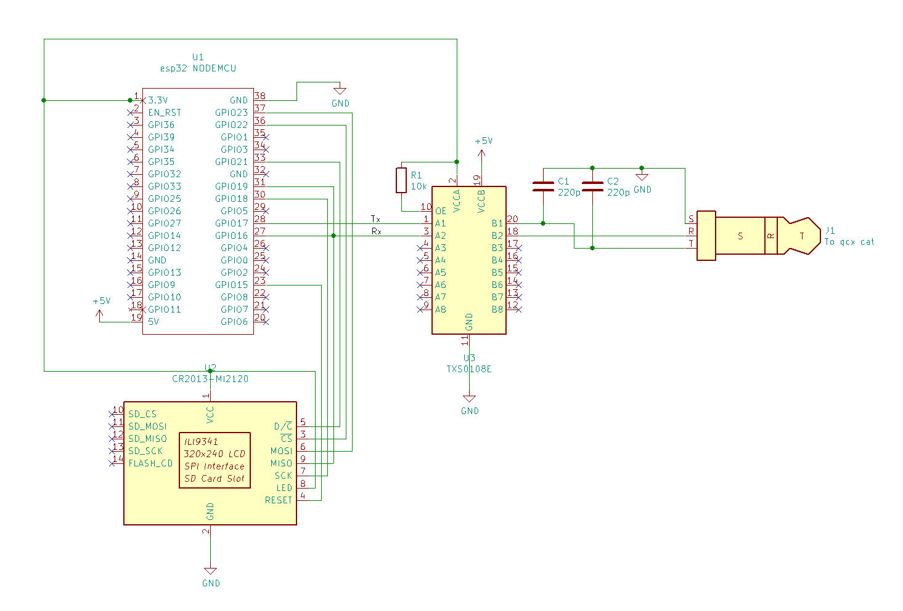

# qcxbox

#### A message box system based on cw and qcx by qrp-labs.

## Intro
Radio amateurs have developed protocols for many years to distribute messages 
from computer to computer by RF.
Starting with Packet Radio in the 80's up to FT8, WSPR, DMR SMS etc.
With these it is possible to transmit messages to other radio amateurs, to store them 
(the messages, not the hams) 
and also to read them at a later time.
With Packet Radio there was even an extensive mailbox system with store and forward 
possibilities.

What all these methods have in common is that I, as the sender or receiver, need a computer 
to send and receive messages. Be it a TNC, a laptop, smartphone or whatever.
Some time ago I wondered if it would be possible to send and retrieve messages  without 
a computer. This should be possible with the help of cw.
 
## Idea 
 
A transceiver is ready to receive at a fixed location and listens on a certain frequency 
to certain cw commands. A connected computer evaluates these and reacts to them. 
So it would be possible to record and retrieve messages.
 
I assembled my first qcx mini a few weeks ago and was immediately hooked. The built-in CAT 
interface can read and send decoded morse code in addition to controlling the 
transceiver.
So the old thought of a "cw-mailbox" came back to my mind and I started a try.

I took an Arduino I found a useless lying around and connected it to the cat interface of 
the qcx mini.
Then a small Arduino sketch and ready was the prototype of the cw-mailbox, which I call 
here *qcx-box*.

So far it is only a proof-of-concept, but it already shows that something like this is 
possible with a qcx and minimal external effort. 

## The procedure

Let's assume that I (dl9bdi) operate my qcx at the qcx-box at my home qth and it listens 
on a certain frequency, e.g. 7.033MHz.
Let's further assume that dn5far wants to leave me a message. Then dn5far calls my 
qcx-box on 7.033MHz simply by giving my callsign. 
The qcx-box recognizes this and replies with a qrz? 
And so it goes

* **dn5far:** *dl9bdi*
* **qcx-box:** *qrz?*
* **dn5far:** *dn5far*
* **qcx-box:** *cmd?*
* **dn5far:** *send*
* **qcx-box:** *kn*
* **dn5far:** *hi Matthias pls call me sk*
* **qcx-box:** *73*

The message *hi matthias pls call me sk* is now stored in the box.
Similarly, messages can be retrieved with a list command.

So far it is only a proof-of-concept, but it already shows that something like this is 
possible with a qcx and minimal external effort.

For a real deployment, a lot more would have to be implemented, such as
* a real message protocol
* correction possibilities in the protocol steps
* time-outs
* management of multiple messages
* memory optimization

On the other hand, the combination of the qcx with a simple microprocessor opens up an 
incredible number of possibilities, e.g.:

* black- and whitelisting of stations
* cw based APRS system
* linking of two or more qcx-boxes to a network, in which received messages are exchanged 
between the boxes.
* maybe useful for emergency responders.

Keep in mind: it's all based on morse code, i.e. every cw-ler can follow the protocol at 
any time with a simple transceiver.
Of course you can't send long emails with this, but twitter has become famous with 140 
characters long messages ;) 
Imagine: sending messages with forty/9er out there.

## More options

A qcx can be controlled via the cat interface in almost all settings. I.e. the qcx-box 
could take over further tasks, e.g.
* set qcx time (if the Arduino gets it e.g. from a ntp-server or has a real time clock)
* select box frequency by itself, if necessary change it by qrm by itself.
* read s-meter values and send them back via cw

and a lot more.

## The set-up

The microprocessor I used is an ESP32 NodeMCU. It has a 3.3V logic level, so it only needs 
a logic level converter TXS0108E (3.3v<->5V) to connect the qcx. That's it.

Schematic: 

The ESP32 NodeMCU has several serial ports, one of them is used to connect to the qcx. 
Another one is left to output to the serial monitor of the Arduino IDE and to 
control the process.
To run the box without a PC and still see the status, I added a display, in this case an 
Adafruit_ILI9341. 
This is not needed but makes much more fun.

Other Arduinos and displays work as well, but these parts were just lying around.

In this set-up you will find a lot more ideas, e.g.

* displaying the received messages on a webserver
* configuration of the qcx via a mobile app
* controlling the qcx via the internet
* ...

## Conclusion
A qcx can be operated as a cw-mailbox with little effort. The project has still so many options 
that it is easy to get lost in it.

So it will be exciting to see if anyone else is interested in such a project.

vy73 de Matthias, 
dl9bdi

---
##### Links
https://qrp-labs.com/

